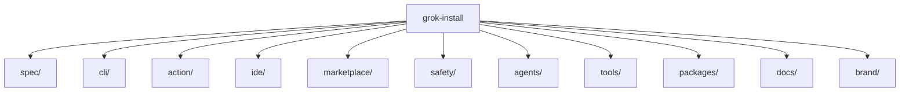

<p align="center">
  
</p>

## What is grok-install?

grok-install is the unified Grok-native agent ecosystem — a single repository housing the YAML agent spec, command-line installer, GitHub Action, IDE extension, web marketplace, and constitution-based safety scanner. Author an agent once and run it through any surface.

## Install

> v1.0 not yet shipped; placeholders here document the planned UX.

```bash
pip install grok-install
```

```bash
curl -fsSL https://grok-install.dev/install.sh | sh
```

```powershell
winget install AgentMindCloud.GrokInstall
```

## Quick start

1. `grok-install init` — scaffold a new agent project in the current directory.
2. `grok-install pick simple/researcher` — install an agent from the catalog.
3. `grok-install run` — execute the agent against your local Grok endpoint.

## Features

grok-install ships six interoperable surfaces around one schema: a versioned YAML **spec** for agents, a cross-platform **CLI** for install/run workflows, a **GitHub Action** for CI-side agent execution, an **IDE extension** providing schema-aware completion and validation, a **marketplace** for discovering and sharing agents, and a **safety scanner** that lints manifests against constitution rules.

## Architecture



## Agents

Browse the catalog at [`agents/README.md`](agents/README.md). A hosted, browsable marketplace launches with v1.0.

## Spec

The current agent manifest schema lives under [`spec/v2.14/`](spec/v2.14/).

## Contributing

See [CONTRIBUTING.md](CONTRIBUTING.md).

## License

Apache-2.0 — see [LICENSE](LICENSE) and [NOTICE](NOTICE).
