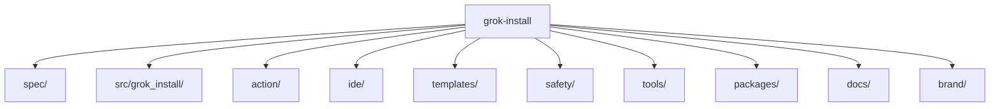

<p align="center">
  
</p>

## What is grok-install?

grok-install is the home of the Grok-native agent manifest standard: the v2.14 YAML spec, a lightweight validator, bundled templates, the GitHub Action and VSCode extension surfaces, the worker and website surfaces, and the brand kit.

## Install

### Install from source (pre-1.0)

```bash
pip install git+https://github.com/AgentMindCloud/grok-install-v2.git
```

### After v1.0 launch

```bash
pip install grok-install
```

## Quick start

Validate an agent manifest against the v2.14 schema:

```yaml
# manifest.yaml
version: "2.14"
name: hello-world
description: A simple greeting agent for demo purposes.
runtime:
  engine: grok
  model: grok-3
deploy:
  targets:
    - worker
```

```bash
grok-install validate manifest.yaml
```

The validator emits JSON-Pointer error paths and rich-coloured diagnostics. Pass a directory to validate every `.yaml` underneath it.

## Layout



## Templates

Bundled manifests live under [`templates/`](templates/). The community-contributed templates carried over from awesome-grok-agents are in [`templates/community/`](templates/community/). Validate the whole set with `grok-install validate templates/`.

## Spec

The current agent manifest schema lives at [`spec/v2.14/schema.json`](spec/v2.14/schema.json). The accepted `deploy.targets` values are `action`, `ide`, `worker`, and `web`.

## Contributing

See [CONTRIBUTING.md](CONTRIBUTING.md).

## License

Apache-2.0 — see [LICENSE](LICENSE) and [NOTICE](NOTICE).
