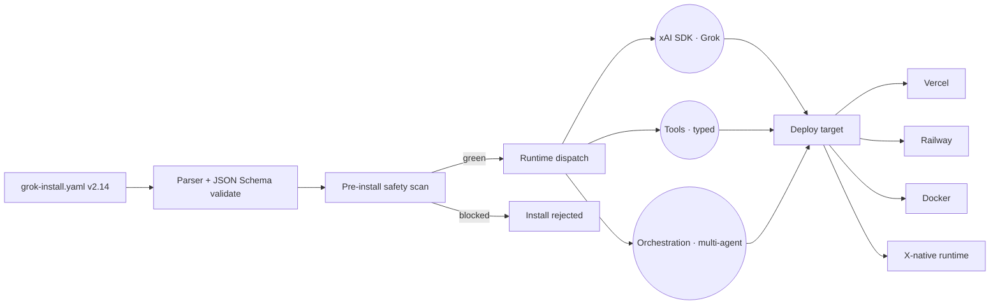

<!-- NEON / CYBERPUNK REPO TEMPLATE · GROK-INSTALL -->

<p align="center">
  
</p>

<h1 align="center">⚡ grok-install</h1>

<p align="center">
  <b>One YAML file. One command. Your agent is live on X.</b><br/>
  The declarative standard that turns any GitHub repo into a Grok-native agent.
</p>

<p align="center">
  
</p>

<p align="center">
  <a href="LICENSE"></a>
  <a href="spec/v2.14/spec.md"></a>
  <a href="https://github.com/xai-org/xai-sdk"></a>
  <a href="https://agentmindcloud.github.io/grok-install"></a>
  <a href="https://agentmindcloud.github.io/grok-install#validate"></a>
  <a href="https://github.com/agentmindcloud/grok-install"></a>
</p>

<p align="center">
  <a href="#60-second-quickstart"><b>Quickstart</b></a> ·
  <a href="spec/v2.14/spec.md"><b>Spec v2.14</b></a> ·
  <a href="#whats-new-in-v214"><b>What's New</b></a> ·
  <a href="https://agentmindcloud.github.io/grok-install"><b>Gallery</b></a> ·
  <a href="examples/"><b>Examples</b></a> ·
  <a href="https://github.com/agentmindcloud/grok-install-cli"><b>CLI</b></a>
</p>

---

## ✦ 60-Second Quickstart

```bash
pip install grok-install
grok-install init my-first-agent
cd my-first-agent
grok-install run
```

Done. Your first Grok agent is live on X. **No Docker. No config files. No guesswork.**

## ✦ Why grok-install

<table>
  <tr>
    <td width="33%">
      <h3>🧬 30 Lines, Not 250</h3>
      <p>Full xAI SDK reply bot in 30 lines of YAML. Equivalent handwritten Python: ~250 lines. Same power, 8× less code.</p>
    </td>
    <td width="33%">
      <h3>🛡️ Safety by Default</h3>
      <p>Pre-install scan blocks hardcoded keys, rate-limit violations, mass-DM patterns, deepfakes. Only green scans get certified.</p>
    </td>
    <td width="33%">
      <h3>🌐 Install from Anywhere</h3>
      <p><code>grok-install install github.com/user/repo</code> — any repo with a valid <code>grok-install.yaml</code> is one command away.</p>
    </td>
  </tr>
</table>

## ✦ Manual SDK vs grok-install

<details>
<summary><b>Full comparison table</b></summary>

| | Writing xAI SDK manually | With grok-install |
|---|---|---|
| Lines of code for a reply bot | ~250 Python | 30 YAML |
| Deploy to Vercel | Manual config | `grok-install deploy --target vercel` |
| Multi-agent swarm | DIY orchestration | Built-in |
| Safety scanning | You build it | Pre-install scan included |
| Rate limiting | DIY | Declarative one-liner |
| Cost limits | DIY | Declarative hard stops |
| Install from GitHub | Clone + wire up manually | `grok-install install github.com/user/repo` |
| Tool schemas | Write JSON Schema by hand | Declared in YAML |

</details>

## ✦ What You Can Build

| Template | Category | Install |
|---|---|---|
| [X Reply Bot](examples/x-reply-bot.yaml) | X-native | `grok-install install agentmindcloud/x-reply-bot` |
| [Research Swarm](examples/research-swarm.yaml) | Multi-agent | `grok-install install agentmindcloud/research-swarm` |
| [Voice Agent](examples/voice-agent.yaml) | Voice | `grok-install install agentmindcloud/voice-agent` |
| [Multi-Agent Coordinator](examples/multi-agent.yaml) | Orchestration | `grok-install install agentmindcloud/multi-agent` |
| Trend-to-Thread Bot | X-native | `grok-install install agentmindcloud/trend-to-thread` |
| Discord AI Moderator | Community | `grok-install install agentmindcloud/discord-mod` |

Browse all templates → [**awesome-grok-agents**](https://github.com/agentmindcloud/awesome-grok-agents)

## ✦ Architecture



## ✦ The Spec at a Glance

```
grok-install.yaml
├── version: "2.14"
├── name / description / category / tags
├── llm (provider, model, api_key_env)
├── tools[] ─── full JSON Schema per tool
│   ├── name + description
│   ├── parameters (JSON Schema object)
│   └── returns (JSON Schema object)
├── rate_limits ─── per-tool QPS + daily caps
├── cost_limits ─── hard USD stops
├── structured_output ─── Pydantic-compatible
├── parallel_tool_calls
├── x_native_runtime (type, permissions)
├── intelligence_layer (function_calling, swarm, ...)
├── orchestration (role, triggers, safety)
├── safety (pre_install_scan, minimum_keys_only, ...)
├── deployment (railway, vercel, docker)
├── telemetry ─── opt-in anonymous events
├── promotion (auto_welcome, auto_share, ...)
└── visuals ─── v2.14: dark-premium install surface (optional)
```

Full spec: [`spec/v2.14/spec.md`](spec/v2.14/spec.md) · v2.13 still at [`spec/v2.13/spec.md`](spec/v2.13/spec.md)

**Validate your YAML live →** [agentmindcloud.github.io/grok-install#validate](https://agentmindcloud.github.io/grok-install#validate)

## ✦ Minimal Example

```yaml
---
version: "2.14"
name: "My Reply Bot"
description: "Replies to X mentions using Grok"

llm:
  provider: "xai"
  model: "grok-4"
  api_key_env: "GROK_API_KEY"

tools:
  - name: "reply_to_mention"
    description: "Replies to a specific X mention"
    parameters:
      type: "object"
      properties:
        mention_id: {type: "string"}
        reply_text: {type: "string", maxLength: 280}
      required: ["mention_id", "reply_text"]
    returns:
      type: "object"
      properties:
        reply_url: {type: "string"}

rate_limits:
  reply_to_mention:
    qps: 0.5
    daily_cap: 200

cost_limits:
  daily_usd: 3.00
  on_limit: "block"

safety:
  pre_install_scan: true
  minimum_keys_only: true
```

## ✦ What's New in v2.14

v2.14 is **additive** — zero breaking changes. It introduces the optional `visuals` block: a declarative way to ship a branded, dark-premium install surface without custom design work.

<table>
  <tr>
    <td width="50%">
      <h3>🎨 Branded Install Surface</h3>
      <p><code>visuals.accent_color</code>, <code>preview_card.style</code> (<code>futuristic</code> / <code>premium</code> / <code>minimal</code>), animated <code>install_flow</code> step track.</p>
    </td>
    <td width="50%">
      <h3>📽️ Demo Media + Dashboards</h3>
      <p>Attach or auto-generate demo assets. Post-install mini-dashboard with animated status, haptics, a11y.</p>
    </td>
  </tr>
  <tr>
    <td>
      <h3>🌓 Auto Light / Dark</h3>
      <p><code>theme.auto_adapt</code> — gallery cards swap palette based on viewer preference. Zero extra config.</p>
    </td>
    <td>
      <h3>♿ Accessibility by Default</h3>
      <p><code>accessibility.alt_text_template</code> generates alt text for every rendered surface automatically.</p>
    </td>
  </tr>
</table>

<p align="center">
  
  
  
  
</p>

- Full reference: [`docs/v2.14/visuals.md`](docs/v2.14/visuals.md)
- Flagship example: [`examples/janvisuals/grok-install.yaml`](examples/janvisuals/grok-install.yaml)
- JSON Schema: [`schemas/v2.14/schema.json`](schemas/v2.14/schema.json)
- Migration notes: [`docs/migration/v2.13-to-v2.14.md`](docs/migration/v2.13-to-v2.14.md)

## ✦ Safety First

Every agent installed via grok-install runs an automated pre-install scan:

- 🔒 No hardcoded API keys
- 🚨 X-posting tools behind approval gates (configurable)
- ⏱️ Rate limits declared — no runaway posting
- 🎯 Permissions explicit and minimal
- ❌ Blocked patterns: deepfakes, mass DMs, spam

Only green-scan agents earn the **Grok-Native Certified** badge.

## ✦ Migrating from v2.12 / v2.13

- **v2.13 → v2.14** is additive, no migration required. See the [v2.13 → v2.14 guide](docs/migration/v2.13-to-v2.14.md).
- **v2.12 → v2.13** has one breaking change (tool declarations require full JSON Schema). See the [v2.12 → v2.13 guide](docs/migration/v2.12-to-v2.13.md), or run:

```bash
grok-install migrate --from 2.12 --to 2.13
grok-install migrate --from 2.13 --to 2.14
```

## ✦ The Ecosystem

<table>
  <tr>
    <td width="33%">
      <h3>📦 grok-install</h3>
      <p><b>This repo.</b> Spec, JSON schemas, landing page, validator.</p>
      <a href="https://github.com/agentmindcloud/grok-install">Repository →</a>
    </td>
    <td width="33%">
      <h3>⚙️ grok-install-cli</h3>
      <p>Official Python CLI and runtime.</p>
      <a href="https://github.com/agentmindcloud/grok-install-cli">Repository →</a>
    </td>
    <td width="33%">
      <h3>🌟 awesome-grok-agents</h3>
      <p>10+ production-ready agent templates.</p>
      <a href="https://github.com/agentmindcloud/awesome-grok-agents">Repository →</a>
    </td>
  </tr>
  <tr>
    <td>
      <h3>📐 grok-yaml-standards</h3>
      <p>12 modular YAML extensions (.grok/ folder).</p>
      <a href="https://github.com/agentmindcloud/grok-yaml-standards">Repository →</a>
    </td>
    <td>
      <h3>🎭 grok-agent-orchestra</h3>
      <p>Multi-agent runtime with mandatory safety veto.</p>
      <a href="https://github.com/agentmindcloud/grok-agent-orchestra">Repository →</a>
    </td>
    <td>
      <h3>📚 grok-docs</h3>
      <p>Full documentation site.</p>
      <a href="https://github.com/agentmindcloud/grok-docs">Repository →</a>
    </td>
  </tr>
</table>

### Data feeds

| File | Purpose |
|---|---|
| [`featured-agents.json`](featured-agents.json) | Curated, certified agents shown in the gallery |
| [`trending.json`](trending.json) | Time-windowed install rankings |

Both are schema-validated and served statically — no backend. See [`docs/data-layer.md`](docs/data-layer.md).

### Tools

| Tool | Purpose |
|---|---|
| [`tools/video-generator`](tools/video-generator) | 60s explainer-video generator — point it at any repo, get MP4s for X/TikTok/Shorts |

**Works with:** xAI SDK (native) · LiteLLM · Semantic Kernel · OpenAI-compatible clients

## ✦ Community & Calls to Action

<table>
  <tr>
    <td width="50%">
      <h3>📝 Submit Your Agent</h3>
      <p>Get listed in the featured gallery — <a href="https://github.com/AgentMindCloud/grok-install/issues/new?template=agent-submission.yml">submission form</a>.</p>
    </td>
    <td width="50%">
      <h3>💬 Weekly Spec Review</h3>
      <p>Join <a href="https://github.com/AgentMindCloud/grok-install/discussions">GitHub Discussions</a> to shape v2.15.</p>
    </td>
  </tr>
  <tr>
    <td>
      <h3>✅ Validate Live</h3>
      <p>Drop your YAML in the <a href="https://agentmindcloud.github.io/grok-install#validate">browser validator</a>.</p>
    </td>
    <td>
      <h3>🎤 Voice + One-Command Install</h3>
      <p>Say <code>@grok install this</code> on any repo — <a href="docs/voice-and-clone-examples.md">examples</a>.</p>
    </td>
  </tr>
</table>

<p align="center">
  <a href="https://github.com/sponsors/JanSol0s">
    
  </a>
</p>

## ✦ Contributing

RFCs for v2.14 are open. Propose a spec change, ship a template, fix a bug. See [CONTRIBUTING.md](CONTRIBUTING.md).

## ✦ Connect

<p align="center">
  <a href="https://github.com/agentmindcloud">
    
  </a>
  <a href="https://x.com/JanSol0s">
    
  </a>
  <a href="https://www.jansolos.com">
    
  </a>
  <a href="https://agentmindcloud.github.io/grok-install">
    
  </a>
</p>

## ✦ License

Apache 2.0 — same as xAI. Patent grant included.

<br/>

<p align="center">
  Built by <a href="https://x.com/JanSol0s">@JanSol0s</a> · Part of <a href="https://github.com/AgentMindCloud">AgentMindCloud</a>
</p>

<p align="center">
  
</p>
