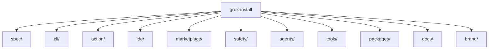

<p align="center">
  
</p>

## What is grok-install?

grok-install is the unified Grok-native agent ecosystem — a single repository housing the YAML agent spec, command-line installer, GitHub Action, IDE extension, web marketplace, and constitution-based safety scanner. Author an agent once and run it through any surface.

## Install

### Install from source (pre-1.0)

```bash
pip install git+https://github.com/AgentMindCloud/grok-install-v2.git
```

### After v1.0 launch

```bash
pip install grok-install
```

## Quick start

Validate an agent manifest against the v2.14 schema:

```yaml
# manifest.yaml
version: "2.14"
name: hello-world
description: A simple greeting agent for demo purposes.
runtime:
  engine: grok
  model: grok-3
deploy:
  targets:
    - cli
```

```bash
grok-install validate manifest.yaml
```

The validator emits JSON-Pointer error paths and rich-coloured diagnostics. Pass a directory to validate every `grok-install.yaml` underneath it.

## Features

grok-install ships six interoperable surfaces around one schema: a versioned YAML **spec** for agents, a cross-platform **CLI** for install/run workflows, a **GitHub Action** for CI-side agent execution, an **IDE extension** providing schema-aware completion and validation, a **marketplace** for discovering and sharing agents, and a **safety scanner** that lints manifests against constitution rules.

## Architecture



## Agents

Browse the catalog at [`agents/README.md`](agents/README.md). A hosted, browsable marketplace launches with v1.0.

## Spec

The current agent manifest schema lives under [`spec/v2.14/`](spec/v2.14/).

## Contributing

See [CONTRIBUTING.md](CONTRIBUTING.md).

## License

Apache-2.0 — see [LICENSE](LICENSE) and [NOTICE](NOTICE).
