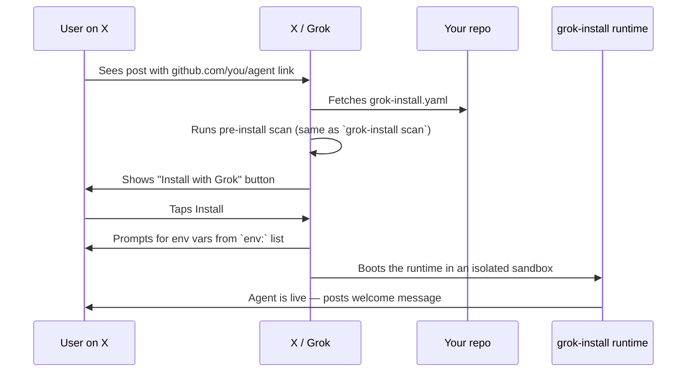

# X integration

The payoff of `grok-install` is the install-on-X flow. This guide
covers how it works, what triggers it, and how to make your agent
discoverable.

## The install flow



## What makes a repo installable

1. `grok-install.yaml` at the root.
2. `spec:` declared with a supported version (`v2.12` current).
3. Clean safety scan — no hardcoded secrets, no unlisted network access.
4. Public repo (or a linked install token for private ones).

## Manifest fields that light up the UI

| Field                | Where it shows                                     |
| -------------------- | -------------------------------------------------- |
| `name`               | Install card title                                 |
| `description`        | Install card body                                  |
| `category`           | Marketplace filter                                 |
| `tags`               | Marketplace search                                 |
| `featured: true`     | Homepage rotation (maintainer-set, not user-set)   |
| `on_install.welcome` | First post the agent makes after install           |

## `@grok` commands

Once the agent is running, users interact with it via `@grok`:

| Command                              | What it does                                   |
| ------------------------------------ | ---------------------------------------------- |
| `@grok install <repo>`               | Installs the agent from any GitHub repo.       |
| `@grok my agents`                    | Opens the user's dashboard.                    |
| `@grok pause <agent>`                | Pauses a running agent.                        |
| `@grok update <agent>`               | Re-runs install from the latest commit.        |
| `@grok remove <agent>`               | Uninstalls.                                    |

Voice commands mirror the text ones on mobile.

## Pre-install scan

Every install triggers a scan identical to
`grok-install scan` locally. It reports:

- Safety profile (`standard` / `strict`)
- Permission summary (tools, network hosts, filesystem, env)
- Dependency audit (licensed, no known CVEs)
- Secret scan (no hardcoded keys)

A clean scan earns the **Verified by Grok** badge on the install card.
Failures block the button.

## Marketplace visibility

To show up in the curated marketplace:

1. Submit to
   [`awesome-grok-agents`](https://github.com/AgentMindCloud/awesome-grok-agents)
   via the template submission flow.
2. Run `grok-install publish` to generate the metadata block.
3. Open a PR with your template under the matching category.

Curated agents go through a human review + automated validation. Once
merged they're visible to any user browsing via `@grok gallery`.

## DM handlers and reply bots

`x_native_runtime` sub-types specialize the install experience:

```yaml
# grok-install.yaml (reply bot)
x_native_runtime:
  type: reply-bot
  permissions: ["tweet.read", "tweet.write"]
  grok_orchestrator: true
```

| `type`           | Behavior                                                             |
| ---------------- | -------------------------------------------------------------------- |
| `reply-bot`      | Watches mentions, posts replies (usually approval-gated).            |
| `dm-handler`     | Watches DMs, can converse privately.                                 |
| `trend-monitor`  | Scheduled; posts when certain trends fire.                           |
| `custom`         | You own the event loop; runtime just supervises.                     |

Each type ships sensible rate-limit defaults and required approvals.
`reply-bot` automatically gates `post_reply` unless you opt out.

## Growth via the Passive Growth Engine

If you declare:

```yaml
promotion:
  auto_welcome: true
  auto_share: true
  weekly_highlight: true
  builder_credits: "@YourHandle"
```

The runtime will:

- Post a welcome card when a user installs.
- Add a "built with grok-install" shareable card per run.
- Include you in the Sunday weekly-highlights thread if your agent
  ranks well on install count and user-rated usefulness.

All opt-in. If you leave `promotion:` off, none of this fires.
